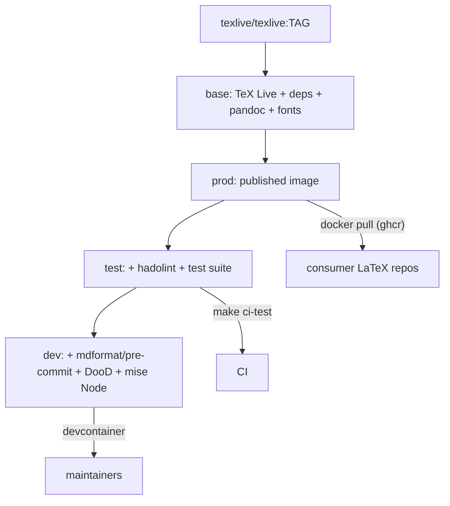

# latex-infrastructure

This repository builds and publishes a Docker base image for LaTeX development inside [VS Code Dev Containers](https://containers.dev/). The image layers a full [TeX Live](https://hub.docker.com/r/texlive/texlive) installation on top of Microsoft's `[devcontainers/base:ubuntu26.04](https://github.com/devcontainers/images/tree/main/src/base-ubuntu)` image (Ubuntu 26.04 LTS, digest-pinned), so private LaTeX project repositories can pull a ready-to-compile environment from the GitHub Container Registry (GHCR) instead of installing TeX Live themselves.

The published image is available at:

```
ghcr.io/vesynta/latex-infrastructure
```

## What's included

- A complete TeX Live tree (`pdflatex`, `lualatex`, `xelatex`, `latexmk`, `tlmgr`, etc.) on `PATH`, `MANPATH`, and `INFOPATH` for the non-root `vscode` user.
- `tlmgr` usable without `sudo` (the TeX Live tree is owned by `vscode`).
- Pre-built font caches (`luaotfload-tool` and `fontconfig`) so the first compilation isn't slowed down by cache generation.
- Common tooling: `make`, `perl`, `python3`, `python3-pygments` (for `minted`), `chktex`, `ghostscript`, `git-lfs`, `nodejs`, `npm`, `gh` (GitHub CLI), `librsvg2-bin` (`rsvg-convert` for SVG → PDF), and the Perl modules required by `latexindent`. Node is on `prod` so consumers can add Node-based tooling; Claude Code is baked into the unpublished `dev` maintainer stage (not a Dev Container `feature`).
- `pandoc` plus a broad, high-quality font set (Liberation, Carlito/Caladea, DejaVu, Noto, TeX Gyre, Latin Modern, FreeFont) so native Word (`docx`) export and other conversions render with proper fonts.
- A pre-created, `vscode`-owned `~/.config/gh` directory so consumer devcontainers that mount a named volume there inherit writable ownership.

## Image architecture

The [Dockerfile](Dockerfile) is multi-stage. Consumers only ever pull `prod`; the `test` and `dev` stages exist for CI and maintainers and are never published:

- `base` - the shared foundation: TeX Live, system dependencies (`gh`, `librsvg2-bin`, …), `pandoc`, and fonts.
- `prod` - `base` plus pre-built font caches. This is the image published to GHCR.
- `test` - `prod` plus the `hadolint` binary and the test fixtures; its default command runs the smoke-test suite (used by `make ci-test`).
- `dev` - `test` plus maintainer doc tooling (`mdformat`, `pre-commit`), baked Docker CLI (`docker-init` DooD), mise Node 22 (Claude Code), and the zsh overlay. Not published; `prod` remains the GHCR artefact.



## Image pins and the `TEXLIVE_IMAGE` build argument

Every `FROM` / `COPY --from` in the [Dockerfile](Dockerfile) is pinned as `image:tag@sha256:…`. Dependabot groups those updates weekly (`docker-prod` for Ubuntu and TeX Live; `docker-unpublished` for maintainer/CI vendor images) so a floating tag cannot silently change the published image.

The TeX Live tree is copied from the `TEXLIVE_IMAGE` build argument. The Dockerfile default is digest-pinned `texlive/texlive:latest-full`. Override it to trade off image size against package coverage, for example:

```bash
docker build --build-arg TEXLIVE_IMAGE=texlive/texlive:latest-medium -t latex-infrastructure .
# or: make build-local TEX_IMAGE_TAG=latest-medium
```

Useful upstream tags include `latest-full`, `latest-medium`, `latest-basic`, and year-pinned variants such as `TL2024-historic`. See the [texlive/texlive tags](https://hub.docker.com/r/texlive/texlive/tags) for the full list. An override that omits a digest is for local experiments; default and CI builds use the pin.

## Using the image in another repository

In a private LaTeX project, reference the published image directly from your `.devcontainer/devcontainer.json`:

```jsonc
{
  "name": "my-latex-project",
  "image": "ghcr.io/vesynta/latex-infrastructure:latest",
  "customizations": {
    "vscode": {
      "extensions": ["James-Yu.latex-workshop"]
    }
  }
}
```

Because GHCR images for private packages require authentication, make sure the consuming repository has access to the package (or that the package is public).

### Using a locally built image instead of GHCR

If you can't pull from GHCR (no access, offline, air-gapped) or you want to modify the image, build it yourself and reference the local tag instead.

From a clone of this repository, build and tag the production image locally:

```bash
make build-local   # builds + tags latex-infrastructure:local
```

Then point your consuming repository's `.devcontainer/devcontainer.json` at that local tag rather than the GHCR path:

```jsonc
{
  "name": "my-latex-project",
  "image": "latex-infrastructure:local"
}
```

A few things to keep in mind:

- The image must exist in the same Docker daemon your Dev Container builds against; Docker won't pull `latex-infrastructure:local` from anywhere, so rebuild it whenever you want updates.
- To trade off size against package coverage (or otherwise customise the build), override `TEX_IMAGE_TAG`, e.g. `make build-local TEX_IMAGE_TAG=latest-medium`.

## Publishing

The [build-and-push workflow](.github/workflows/build-and-push.yml) builds the image and pushes it to GHCR on every push to `main` and `dev`, and on manual `workflow_dispatch`. It uses GitHub Actions cache (`type=gha`) plus cache-dance for apt mounts on ephemeral `ubuntu-latest` runners. Cache-mount IDs (`vesynta-*`) are shared with other Vesynta builders: [infrastructure](https://github.com/Vesynta/infrastructure/blob/dev/docs/docker-build-cache.md) `docs/docker-build-cache.md`. Tags are derived automatically by `[docker/metadata-action](https://github.com/docker/metadata-action)`.

The [CI Test workflow](.github/workflows/ci-test.yml) builds the `prod`, `test`, and `dev` stages on pull requests (without pushing) and runs the smoke-test suite, so a broken stage cannot merge green.

## Getting started (maintainers)

> **Prerequisites:** Docker, Git, and VS Code or Cursor with the Dev Containers extension.

1. Clone this repository and Command Palette → **Dev Containers: Reopen in Container**. Compose builds the `dev` stage via `[.devcontainer/docker-compose.yaml](.devcontainer/docker-compose.yaml)`.
1. Compose mounts the host Docker socket and runs `docker-init`; there are **no** Dev Container `features`. This public image does not ship team MCP client configs.
1. `postCreateCommand` runs `make setup` and pre-warms pre-commit environments.

Consumers should pull `prod` from GHCR (see above) rather than developing against this maintainer container.

## Local maintenance

This repository ships its own `[.devcontainer/devcontainer.json](.devcontainer/devcontainer.json)`, which builds the `dev` stage via `[.devcontainer/docker-compose.yaml](.devcontainer/docker-compose.yaml)`, so maintainers can open the repo in a Dev Container and test image changes before publishing. Compose mounts the host Docker socket and runs `docker-init`; there are no Dev Container `features`.

Common tasks are wrapped in the [Makefile](Makefile):

```bash
make build       # build the production image
make build-local # build + tag the prod image locally as latex-infrastructure:local
make build-dev   # build the devcontainer (dev stage) image
make ci-test     # run hadolint + the LaTeX smoke test suite in Docker
make lint        # run hadolint against the Dockerfile
make format-docs # format markdown with mdformat
make setup       # install git hooks
make pre-commit  # run all pre-commit hooks
```

Tests run inside the `test` image via `[docker-compose.test.yaml](docker-compose.test.yaml)`. Pull-request CI builds `prod`, `test`, and `dev` through the [CI Test workflow](.github/workflows/ci-test.yml), then runs the same smoke suite. A lighter [pre-commit workflow](.github/workflows/pre-commit.yml) gates formatting and linting.

## License

Released under the [MIT License](LICENSE).
